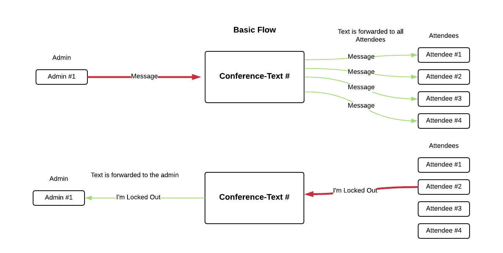

<div align="center">

# conference-text

<a href="http://dev.bandwidth.com"></a>
</div>

Let the conference organizer message the team with updates


## Prereqs

This app assumes a least a mild understanding of the following:

* [NodeJS](https://nodejs.org/en/)
* [MongoDB](https://www.mongodb.com/)
* [Express](https://expressjs.com/)
* [Bandwidth](https://bandwidth.com/)
* [Git](https://git-scm.com/)

## .env file

Copy the [.env.sample](.env.sample) file to `.env` and fill in the following variabls found in your [dashboard](https://dashboard.bandwidth.com).

```
MONGODB_URI=
BANDWIDTH_ACCOUNT_ID=
BANDWIDTH_API_TOKEN=
BANDWIDTH_API_SECRET=
BANDWIDTH_APPLICATION=
```

## Bandwidth Phone Number Setup

The conference-text tool requires two different phone numbers to be ordered and assigned to the **same** application within the [dashboard](https://dashboard.bandwidth.com).

* A **toll-free** number to use as the `bandwidthMemberNumber` that will send messages to each 'member'.
* A **long-code** (normal, good ole fashioned phone number) that will be used to create a **group-mms** to all the admins. As such, the app is limited to no more than 10 admins.

## Introduction Text Setup

Buried away in the [`routes/group.js`](routes/group.js) file there are two variables in the `router.post` function.

> ⚠️ These _should probably be moved to the group-creation logic, but for now they're hard-coded 😭_

| variable    | description                                                                        |
|:------------|:-----------------------------------------------------------------------------------|
| `adminText` | The introduction text sent to the **ADMINS** to create the inital group-mms thread |
| `groupText` | The introduction text sent to the **members** upon group creation                  |

## Text-flow



## Overview

### Create a "group"

Groups need a list of:
* admins consistenting of
    - "Name"
    - "Phone Number"
* attendees consistenting of
    - "username" (`dtolbert` or something similar)
    - "Phone Number"

On group creation send an introduction text:
* as a "group" message to all the admins
* as an individual sms (will need to iterate each) to the attende

#### Group Creation HTTP request

The Groups are created by a `POST` request to the `/groups` path

| Key                     | Type             | Description                                                                                                                                |
|:------------------------|:-----------------|:-------------------------------------------------------------------------------------------------------------------------------------------|
| `adminNumbers`          | array of strings | A list of e164 phone numbers associated to the group admins, these are the phone numbers that can send messages to everyone                |
| `bandwidthAdminNumber`  | string           | A e164 **long code** that will be used to create and proxy messages from the **group-mms** of admins specified in the `adminNumbers` array |
| `bandwidthMemberNumber` | string           | A e164 **toll-free** number that will be used to send individual messages to/from the members                                              |
| `members`               | array of objects | A list of the members and their information                                                                                                |
| `members.name`          | string           | human readable name                                                                                                                        |
| `members.userName`      | string           | a no-white-spaced name that will be used for admins to message members directly                                                            |
| `members.phoneNumber`   | string           | The e164 phone number of the member                                                                                                        |

```
curl --location --request POST 'localhost:3000/groups' \
--header 'Content-Type: application/json' \
--data-raw '{
    "adminNumbers": ["+19198675309", "+19197891145"],
    "bandwidthAdminNumber": "+19842550944",
    "bandwidthMemberNumber": "+18882550944",
    "members": [
        {
            "name": "Dan Tolbert",
            "userName": "dtolb",
            "phoneNumber": "+19197891147"
        }
    ]
}'
```


### On inbound message

* Check the `from` number to find in a group
  - If not in a group, just ignore the inbound sms
* If the `from` number is an attendee 
  - Check the text for `stop` if there, then remove them from the group
  - prepend the `username` to the message
  - forward the message as a group message to the admins
* If the `from` number is an admin
  - Check the first character for `#` or `@` otherwise it's intended as a message for just the other admins to see
* if the first character is an `@` the message is intended for a **SPECIFIC** attendee
  - message should be like `@dtolbert food is at a 11`
  - look up the user's phone number in the group by username
  - send **ONLY** the message after the `@dtolbert` to only that phone number
* if the first character is an `#` the message is intended for **ALL** attendees
  - message should be like `# hey all, need you to be at the booth by 11`
  - look up the list of attendees phonenumbers'
  - iterate over the list and send **ONLY** the message after the `#`

### All together

* Admins can message each other in a group sms without attendees receiving the message unless the message is prefixed with a:
  - `#` to send to **ALL** Attendees
  - `@{username}` to send to a specific attendee
* Attendees can message to the number to ask questions of admins
* Attendees can receive messages from the number with updates either to the whole group or just themselves

### Admin view


### Attendee View


